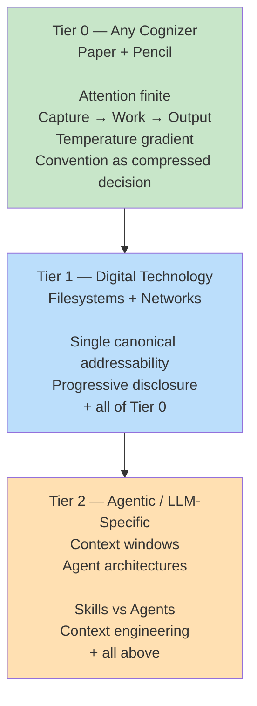

> [!note]- TL;DR
> Every principle in this scaffold assumes something about the substrate it applies on. The cleanest honesty-check is the **paper-and-pencil test**: would this still be true if you replaced all technology with notebooks and filing cabinets? If yes, it's **zero-tier**. If it depends on digital storage, it's **tier 1**. If it depends on LLMs or agentic architecture, it's **tier 2**.

## The claim

Principles come in **scopes of applicability**. A claim like *"attention is finite"* holds for any cognizer — human, AI, or a committee — regardless of whether they use paper, filesystems, or neural interfaces. A claim like *"files should have canonical paths"* assumes you have files. A claim like *"skills load into agent context"* assumes LLM architecture.

These are different scopes, and **treating them as equally solid is a category error**. Our `01-kernel/principles/` folder currently mixes all three scopes without flagging which is which. This page names the distinction.

---

## The three tiers

Each tier builds on the previous, narrowing scope from universal cognition to LLM-specific tooling:



The cards below link into each tier's detail section:

<div class="strata-diagram">
<div class="strata-axis"><span>◄ substrate-agnostic</span><span>tech-bound ►</span></div>
<div class="strata-row">
<a href="#zero-tier" class="strata-card strata-card-1"><span class="strata-level">T0</span><span class="strata-name">Zero-tier</span><span class="strata-tag">True of any cognizer, any substrate</span></a>
<a href="#tier-1" class="strata-card strata-card-2"><span class="strata-level">T1</span><span class="strata-name">Tier 1</span><span class="strata-tag">Assumes digital tech</span></a>
<a href="#tier-2" class="strata-card strata-card-3"><span class="strata-level">T2</span><span class="strata-name">Tier 2</span><span class="strata-tag">Assumes agentic stack</span></a>
</div>
</div>

<a id="zero-tier"></a>

### Zero-tier — Knowledge work, any substrate

Claims about cognition and coordination that hold whether the cognizer is a human with paper, a pre-digital office, a modern team, or an AI. They pass the **paper-and-pencil test**: restate them with "notebook" in place of "file" and they still hold.

**Examples from this scaffold:**

- *Capture → Work → Output* — any cognitive system has raw intake, refinement, and stable output regimes. Notebooks have inboxes and archives.
- *Temperature gradient* — recently-used material deserves easier access than rarely-used. Applies to desks, filing cabinets, and filesystems.
- *Attention is finite* — the basis of [progressive disclosure](./04-progressive-disclosure/).
- *Convention compresses past decisions* — [convention principle](./05-convention-as-compressed-decision/) derives here; language itself is the proof.
- *Meta / self-reference is a property of any sufficiently expressive system* — [meta-self-reference principle](./09-meta-self-reference/).
- *The five strata themselves* — a claim about conventions in general, not about LLMs.

See the [philosophical lineage](../start/philosophical-alignment/#philosophical-lineage--what-this-scaffold-inherits-from) table — zero-tier claims usually have deep prior thinkers (Drucker, Simon, Wittgenstein, Luhmann).

<a id="tier-1"></a>

### Tier 1 — Knowledge work with digital technology

Claims that derive from zero-tier but assume **addressable digital storage, networks, programmable tools**. Would still apply to a pre-AI office computer setup. Wouldn't apply to a paper office.

**Examples from this scaffold:**

- *Single canonical addressability* — [principle](./06-single-canonical-addressability/). Zero-tier ancestor: "ambiguous reference breaks coordination." Tier-1 version: "filesystems should have one canonical path per resource."
- *Progressive disclosure* — zero-tier claim (attention finite) becomes tier-1 once you're applying it to hyperlinked/hierarchical digital docs.
- *Four channels of context* — partially tier-1 (notification, query, context-reload patterns) and partially tier-2 (LLM-specific context windows).

<a id="tier-2"></a>

### Tier 2 — Agentic / LLM-assuming

Claims that depend on current AI tooling — context windows, agent architectures, skill/tool loading, model invocation.

**Examples from this scaffold:**

- *Skills vs Agents* — directly tied to how LLM tooling separates passive expertise from active execution. Zero-tier ancestor: Ryle's "knowing-how vs knowing-that."
- *Context engineering* — assumes LLMs with finite context windows.
- Most of `02-stack/` — opinionated patterns for Claude Code + agent tooling.

---

## The paper-and-pencil test

When writing or auditing a principle, rewrite it substituting:

- "file" → "notebook page"
- "filesystem" → "filing cabinet"
- "agent" → "assistant"
- "context window" → "working-memory capacity"
- "LLM" → "reasoning agent"

If the rewritten version still holds, the principle is **zero-tier**. If it only holds in the digital version, it's **tier 1 or 2**.

This isn't about taking zero-tier more seriously than tier-2. It's about **knowing what's stable**.

---

## Why this matters

### 1. Longevity

Zero-tier content should never need rewriting unless our understanding of cognition itself changes. Tier-2 content will need updating as AI tooling evolves. Tagging the tier makes "how often does this rot?" visible.

### 2. Forkability

```
  Someone building paper-based knowledge work → inherits zero-tier only
  Someone building digital-but-not-AI system  → inherits zero + tier 1
  Someone building agentic system             → inherits zero + tier 1 + tier 2
```

A fork-user who doesn't use AI still gets value from zero-tier + tier-1 principles if they're flagged. Without the flag, they have to filter.

### 3. Epistemic honesty

Without this distinction, every principle looks equally solid. Tagging tier-of-abstraction lets AI agents and readers **weight advice by stability**.

---

## Relation to the five strata

These are **orthogonal axes**. Strata measure repeatability of conventions (how much of a convention ports verbatim). Tiers of abstraction measure scope of applicability (what substrate a claim assumes).

|  | Stratum = how much ports | Tier = what it assumes |
|---|---|---|
| Same page can be | S1 (philosophy), S2 (pattern), ..., S5 (instance) | T0 (zero), T1, T2 |
| Question answered | "If I copy this, how much changes?" | "Where does this claim apply?" |
| A zero-tier S2 pattern | Pattern-shaped; substrate-agnostic | e.g., "Capture → Work → Output" framework shape |
| A tier-2 S5 instance | Live instance content; LLM-assuming | e.g., "my current Claude Code agent config" |

See the [five-strata principle](./07-five-strata/) for the stratum axis and its imperfection caveat — both axes are lenses, not taxonomies.

---

## Imperfection caveat

Like the five strata, this three-tier classification is a **lens, not a taxonomy**. Many principles straddle:

- *Progressive disclosure* has a zero-tier core (finite attention) AND a tier-1 application (hyperlinked docs) AND a tier-2 application (LLM context management). Tag it by the **dominant** framing in the text.
- *SEACOW* is structurally zero-tier (any system has entities, activities, medium) but most worked examples are tier-1/2.
- The abstraction hierarchy itself — tiers 0/1/2 — is borrowed from computer science (OSI stack, abstraction ladders) which is tier-1 at minimum. Even naming this framework commits us to a tier-1+ reading.

When in doubt, mark **higher** (more abstract / zero-tier) — it's easier to add tech-specificity later than to retract it.

---

## How to use this in practice

**When writing a principle:**

1. Apply the paper-and-pencil test.
2. Tag `tier_of_abstraction: 0 | 1 | 2` in frontmatter.
3. Name the zero-tier ancestor in the body if the principle isn't zero-tier itself.
4. Link to [PHILOSOPHICAL-ALIGNMENT](../start/philosophical-alignment/) for the thinker(s) behind the claim.

**When auditing:**

- Grep frontmatter for `tier_of_abstraction: 0` — these are your most stable claims.
- Grep for `tier_of_abstraction: 2` — these are your rot-prone claims; plan for rewrites.

**When forking:**

- Inheriting zero-tier: safe anywhere. No filter needed.
- Inheriting tier-1: assumes your fork uses digital tools.
- Inheriting tier-2: assumes your fork uses AI tooling similar to Claude Code / OpenCode.

---

## See also

- [Philosophical Alignment](../start/philosophical-alignment/) — the prior thinkers behind each claim
- [Five Strata of Repeatability](./07-five-strata/) — the orthogonal axis (how much ports)
- [Philosophy](../start/philosophy/) — the scaffold's claims about knowledge work overall
- [Meta / Self-Reference](./09-meta-self-reference/) — this page itself is a worked example of a meta-principle
