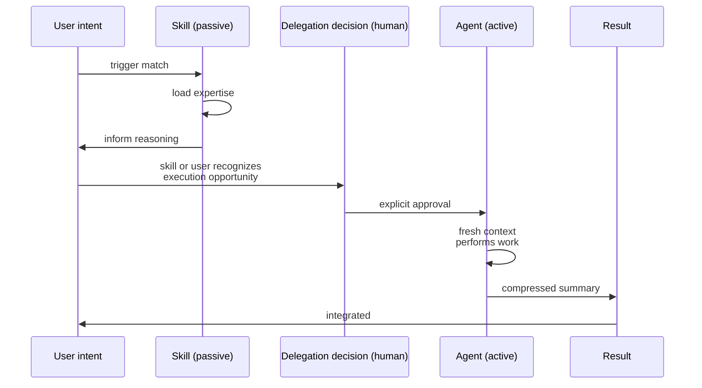

## The claim

Two kinds of knowledge-work components are structurally distinct and must not be conflated:

- A **skill** is *passive expertise* — knowledge that informs decisions without acting. It loads into the current context, influences reasoning, and returns no artifact of its own.
- An **agent** is an *active executor* — a worker that operates in isolated context, performs a task, and returns a compressed result.

A scaffold that treats these as variations of the same thing produces components that try to both inform and execute — and succeed at neither role.

## The evidence

The distinction appears in multiple disciplines under different names because it is load-bearing, not cosmetic.

**Aristotelian metaphysics** — Aristotle distinguished *dunamis* (latent capacity, potential) from *energeia* (actuality, act-in-progress). A skilled carpenter who is asleep is *dunamis*; the same carpenter sawing wood is *energeia*. The distinction is not about skill level but about mode of existence: capacity versus action.

**Cognitive science** — Endel Tulving (1972, extended by John Anderson) divided long-term memory into:
- **Semantic memory** — facts and competences, passive, loaded on demand ("Paris is in France")
- **Procedural memory** — how-to knowledge, invoked when doing ("how to ride a bike")
- **Episodic memory** — what happened, narrative trace ("I rode a bike yesterday")

Semantic memory is skill-like; procedural memory is agent-like (activated by task context, produces action).

**Agentic AI systems** — MemGPT (Packer et al., 2023) explicitly distinguishes *main context* (currently loaded knowledge) from *external context* (callable functions and retrieval). Claude Code formalizes the same split: skills load into the main context window; agents spawn fresh contexts via the Task tool. BMad, Roo, and Agent OS each have analogous splits.

The pattern is not an implementation detail of any specific tool. It is the structural fact that the same workspace has to carry **things-that-inform** and **things-that-act**, and they have different requirements.

## Why they are different

| Aspect | Skill (passive) | Agent (active) |
|---|---|---|
| Context | Main (shared with conversation) | Fresh (isolated) |
| Activation | Semantic match on description | Explicit invocation or proactive by description |
| Output | Influence on reasoning | Compressed result returned to caller |
| Tool access | None (read-only influence) | Full (reads files, runs commands, writes) |
| Composition | Can load in any order | Sequential in Claude Code; recursive in OpenCode |
| Failure mode | Wrong knowledge loads, bad reasoning | Task fails or returns incomplete |

A skill that tries to "do things" steals context budget without compensating value — the reader cannot tell where the knowledge ends and the action begins. An agent that tries to "just inform" wastes the fresh-context affordance that made delegating worthwhile.

## Why this matters for scaffolds

Scaffolding designs collapse if skills and agents are interchangeable. The failure is predictable:

- Components accrete tool invocations they shouldn't have → they become pseudo-agents that pollute main context
- Components advertise themselves as "will do X for you" → users expect execution, get only influence, lose trust
- Composition breaks because the call graph is opaque — neither pure-functional nor pure-imperative

The solution is not to pick one; both are needed. It is to keep them structurally separate at the file layer: `skills/` and `agents/` are different directories with different schemas and different contracts.

:::caution
Skills have **no tool access** — not even read-only. A "skill" that reaches for file reads, grep, or shell is an agent in disguise. If your passive-expertise component executes actions, split it: skill for knowledge, agent for execution. Mixing them silently violates the passive/active boundary the principle is built on.
:::

A skill cannot act; an agent cannot merely inform. Their composition is a deliberate hand-off, not a pipeline:

The `delegation-advisor` skill exists specifically to broker the skill-to-agent transition — it recognizes when active execution is warranted and asks before spawning.

## How this scaffold expresses it

- `01-kernel/skills/<name>/SKILL.md` — passive expertise. YAML frontmatter with `description` (semantic trigger). No tool list.
- `01-kernel/agents/<name>.md` — active executor. YAML frontmatter with `description`, `tools`, optional `model`, optional preloaded `skills` list.

An agent may preload skills (loading passive expertise into its fresh context before working). A skill never spawns an agent — that would invert the passive-active contract.

## Implications for agents

- An AI agent asked "should this be a skill or an agent" should apply the dunamis/energeia test: does it *inform reasoning* or *perform action*? If the output is tokens in the current context, it's a skill. If the output is a completed artifact and a returned summary, it's an agent.
- Components that want to "suggest and then act if approved" are naturally two components: a skill that detects the opportunity, an agent that performs the action, and a glue (often a command or the delegation-advisor pattern) that mediates.

## See also

- [Four Channels of Context](08-four-channels-of-context.md) — which channel each component manages
- `skill-patterns` skill — designing effective skills
- `agent-patterns` skill — designing effective agents
- `delegation-advisor` skill — mediating the skill-to-agent transition

## References

- Aristotle, *Metaphysics* (Book IX, on potentiality and actuality)
- Endel Tulving, "Episodic and Semantic Memory" (1972)
- Packer et al., "MemGPT: Towards LLMs as Operating Systems" (2023)
- Anthropic, Claude Code documentation on skills and Task tool subagents
