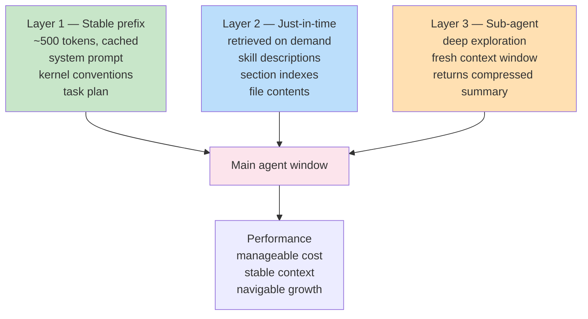

## The claim

Agent context is a **finite, non-uniform, cache-sensitive** resource whose performance degrades with size in ways users cannot predict from the face of the prompt. Progressive disclosure — surfacing only what is needed at the depth it is needed, retrieving the rest just in time — is not a UX preference. It is the only architectural response that simultaneously addresses three empirically-demonstrated failure modes of large-context inference.

## The evidence

### 1. Context rot — performance degrades with input size even on trivial tasks

Chroma Research's "Context Rot" study (Hong, Troynikov & Huber, July 2025) evaluated 18 frontier models and found performance drops non-uniformly as input grows, **even on tasks as trivial as "repeat this string."** On more realistic retrieval tasks:
- A single distracting passage measurably hurt accuracy
- Four distractors collapsed performance, with Claude often refusing and GPT often hallucinating
- Full conversation histories (~113K tokens) dropped accuracy ~30% compared to focused 300-token versions of the same information

The classical needle-in-a-haystack benchmarks had overstated real-world capability because the queries shared lexical overlap with the needles. Break the overlap, and accuracy cliffs.

### 2. Lost in the middle — U-shaped attention

Liu et al.'s "Lost in the Middle" (2307.03172, TACL 2024) demonstrated a U-shaped recall curve across all major models: information at the **primacy** (beginning) and **recency** (end) positions is retrieved reliably; information in the middle is dropped. Mechanistic follow-up work ("Found in the Middle," 2406.16008) traced the pattern to an intrinsic U-shaped attention bias independent of content relevance. This means RAG chunk order matters more than practitioners typically assume — and that "dump all relevant docs into the prompt" is an anti-pattern even when token limits allow it.

### 3. Prompt cache economics — cache miss is ~10× cache hit

Anthropic's `cache_control` feature allows byte-exact prefix caching for dramatic cost reduction — cached prefix reads at roughly 0.1× base cost, post-cache content at 1× (or 1.25–2× if written). The catch: the cache requires **byte-exact prefix match**. Any volatility in the prefix — an injected timestamp, reordered JSON keys, mid-conversation compaction — invalidates everything downstream.

This converts a stylistic preference ("put stable content first") into a hard 10× cost gradient and imposes a discipline of **append-only, monotonic forward context construction**.

## What this forces architecturally

Taken together, the three results say: context is not a container to fill. It is a resource to ration, under rules that punish size, order, and volatility all at once.

The only known response that addresses all three:

1. **A small, stable, high-signal prefix that caches** — the system prompt, a kernel of conventions, the current task plan. Under ~500 tokens ideally.
2. **Just-in-time retrieval of detail via tools** — load files only when needed, so middle positions aren't wasted on low-probability context.
3. **Sub-agent delegation for deep work** — single windows never reach the degradation regime because deep exploration happens in a fresh window that returns a compressed summary.

Progressive disclosure operates as three simultaneous layers, not sequential choices — each addressing one of the failure modes above:

Anthropic's September 2025 "Effective Context Engineering for AI Agents" names these three explicitly: **compaction**, **structured note-taking**, and **sub-agent architectures**. This scaffold adds a fourth: **hooks that gate loading via deterministic predicates**, so reasoning power is not spent deciding whether a file is needed.

## Why this matters beyond performance

Progressive disclosure is not just a speed or cost optimization. It is how an agent scaffold remains navigable as the workspace grows past what a single context window can fit. Without it:
- Large projects become unusable because every prompt loads every file "just in case"
- Or large projects become fractured because agents only see a random sample and produce locally-coherent but globally-wrong results
- Or users manually curate context every turn, which is exhausting and brittle

With it:
- The cheap tier (conventions, system prompts, stratum tags) always loads
- The medium tier (section indexes, skill descriptions) loads when relevant
- The expensive tier (full file contents) loads only when specifically requested
- Depth is traded for breadth on demand

## How this scaffold expresses it

| Layer | Always loaded | Loaded on demand |
|---|---|---|
| **Conventions** | `CLAUDE.md`, `AGENTS.md`, stratum schema | — |
| **Structure** | Directory tree, frontmatter snippets | Full file contents |
| **Skills** | Skill descriptions (YAML) | Full skill body when description matches |
| **Agents** | Agent descriptions | Fresh context on invocation |
| **Research** | Index files | Deep-dive articles |
| **Knowledge** | `02-learnings/` summaries | `03-reference/` + `04-archive/` on demand |

The hooks (`check-complete.sh`, `read-plan.sh`, `check-knowledge.sh`, `update-attention.sh`) extend this discipline: deterministic scripts answer "do we need to load X?" without burning reasoning tokens to decide.

The kernel/stack/work tier structure is itself a progressive disclosure device — kernel loads first and is smallest; stack loads when setup matches; work loads when the task is user-specific.

## Implications for agents

- Prefer loading a one-line description over a full file when deciding whether a resource is relevant.
- When investigating a codebase, delegate exploration to a sub-agent (built-in `Explore` or custom) rather than reading dozens of files into main context.
- When receiving a long document, compact or summarize it before allowing it to propagate into subsequent turns.
- Write intermediate findings to disk (`task_plan.md`, `00-inbox/` captures) rather than letting them accumulate only in the conversation history.
- Respect the append-only cache discipline: do not inject volatile content (timestamps, random IDs) into prefixes.

## See also

- [Temperature Gradient](02-temperature-gradient.md) — access-frequency signals for ordering
- [Four Channels of Context](08-four-channels-of-context.md) — the channels that progressive disclosure manages
- [Five Strata of Repeatability](07-five-strata.md) — progressive disclosure across portability tiers
- `01-kernel/patterns/hook-pattern.md` — deterministic context gates
- `delegation-advisor` skill — knowing when to spawn a sub-agent
- [RPI Context Engineering](../../research/learnings/2025-12-20-rpi-context-engineering.md) — sub-agent architectures as a concrete disclosure strategy
- [Anthropic skills paradigm](../../research/learnings/2025-12-20-anthropic-skills-paradigm.md) — progressive disclosure operationalized in Claude Code skills

## References

- Hong, Troynikov & Huber (Chroma Research), "Context Rot: How Increasing Input Tokens Impacts LLM Performance" (July 2025)
- Liu et al., "Lost in the Middle: How Language Models Use Long Contexts" (2307.03172, TACL 2024)
- "Found in the Middle" (2406.16008) — mechanistic follow-up
- Anthropic, "Effective Context Engineering for AI Agents" (September 2025)
- Anthropic, Prompt Caching documentation (`cache_control`)
- Jakob Nielsen, "Progressive Disclosure" (1995) — the UX-level antecedent
