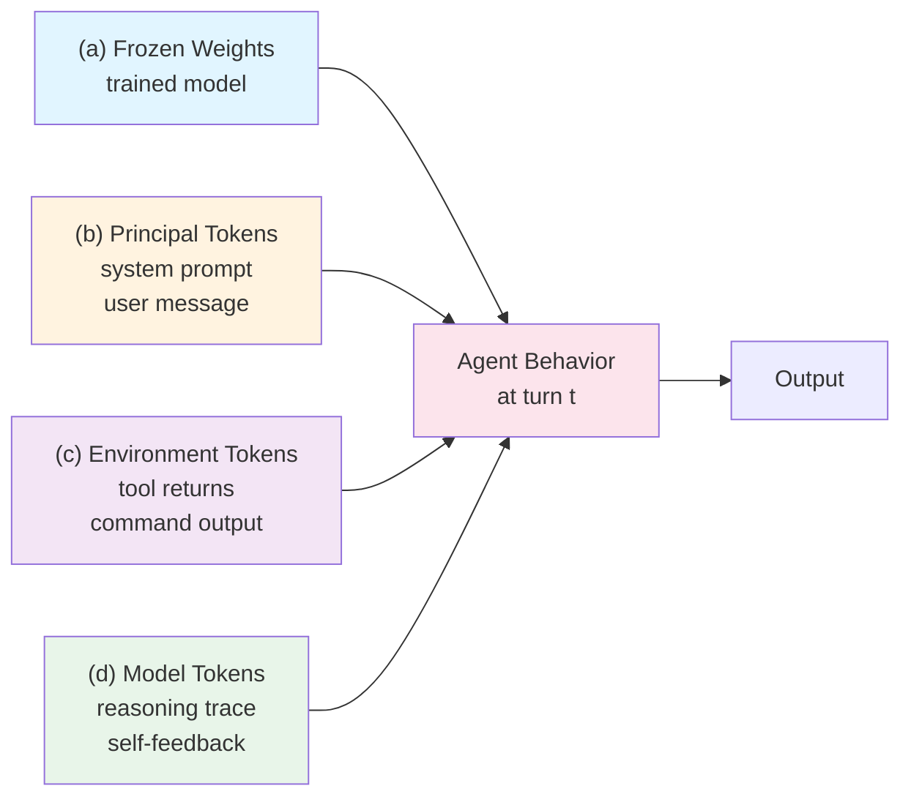

## The claim

An AI agent's behavior at turn *t* is determined by four distinct input channels:

- **(a) Frozen weights** — the trained model, immutable during inference
- **(b) Principal-authored tokens** — system prompt, user message, injected docs, tool specs
- **(c) Environment-authored tokens** — tool returns, retrieved content, command output
- **(d) Model-authored tokens** — reasoning traces, tool arguments, intermediate plans that recursively feed back

Every agent pathology — hallucination, drift, prompt injection, sycophantic agreement with earlier wrong claims — localizes to one or more of these channels. Treating them as a single "context" obscures which dial is being turned and where the fix belongs.

## Why four, not two

A simpler model says: "agent behavior = weights + context window." That is roughly correct and catastrophically insufficient for engineering.

The problem: the context window is not a uniform container. It has a **principal-authored** region (what the user or system put there deliberately) and a **non-principal-authored** region (what tools returned, what the model wrote back to itself). These have different failure modes and different mitigations.

Three things that the two-channel model elides:

### 1. Tool feedback is perception, not retrieval

When an agent runs `bash("ls /etc")`, the model **chose** to look but did not choose what is there. The environment authored the return value. This asymmetry is exactly what prompt-injection attacks exploit — a retrieved webpage can contain instructions the orchestrator never intended. The mitigation is not "write a better prompt"; it is **tool permission scoping and output sanitization at the channel boundary**.

### 2. The model's own generated tokens are a third channel

Every reasoning trace, every tool argument, every intermediate plan is appended to the next turn's context. Good self-conditioning is why chain-of-thought works. Bad self-conditioning is why models spiral into rumination, confabulation, or sycophantic agreement with earlier wrong claims.

MemGPT, Mem0, and sub-agent compaction are all partly about **laundering this self-generated stream** before it poisons the next turn. The mitigation is compaction, summarization, and explicit reset — not prompting harder.

### 3. Weights are frozen context, not outside the frame

The two-channel model says "weights are static, so they don't matter for runtime behavior." Many "context problems" are actually weight problems dressed up: a model that doesn't know a library's API hallucinates regardless of how clean the window is; a model RLHF'd to be sycophantic agrees regardless of retrieved evidence. Chroma Research's finding that Claude and GPT behave **differently** on the same context is a weights effect.

The mitigation for weight-channel issues is not context engineering — it is model selection, fine-tuning, or retrieval augmentation strong enough to override the prior.

These four channels feed into a single inference decision point, each with distinct failure modes and mitigations:

## What each channel's component handles

The four-channel view lets each scaffold component be classified by which channel it operates on:

| Channel | Component class | Examples in this scaffold |
|---|---|---|
| (a) Weights | Model selection | Choosing Haiku for tight loops, Sonnet for reasoning, Opus for deep synthesis |
| (b) Principal | System prompt, injected docs | `CLAUDE.md`, skills, kernel principles, AGENTS.md, tool specs |
| (c) Environment | Tool permissions, output filters | Permission allowlists, MCP server selection, hook gates |
| (d) Self-generated | Compaction, summarization | Sub-agent delegation, `task_plan.md` checkpointing, auto-summary hooks |

A scaffold that has mature components for only one channel leaks through the others.

## The principle-restated (replacing the two-channel version)

> **An agent's behavior at turn t is determined by (a) frozen weights, (b) principal-authored tokens, (c) environment-authored tokens admitted via tools, and (d) model-authored tokens recursively fed back. Context engineering is the discipline of managing (b), gating (c), and laundering (d) so the sum respects the finite, non-uniform attention budget imposed by (a).**

This is the four-channel version of the common slogan "context is all you need for runtime behavior." It is more precise and it matches engineering intuition about which fix goes where.

## Practical implications for scaffolding

**When debugging agent behavior, localize the channel first.** Before adjusting the prompt, ask:

- Is this a behavior the model clearly cannot do regardless of context? → **(a) weights** — change model or add retrieval.
- Is the instruction in the prompt but being ignored or misinterpreted? → **(b) principal** — clarify, move earlier in prompt, check for conflicting rules.
- Is the model reacting to something a tool returned? → **(c) environment** — check for injection, narrow tool scope, filter outputs.
- Is the model referencing its own earlier incorrect reasoning? → **(d) self-generated** — compact, summarize, or reset.

**When designing a new component, label its channel.** A skill is a (b) component. A hook is a (c) gate. A compaction subagent is a (d) launderer. A model-selection config is an (a) dial. Labeling prevents one component from trying to fix all four badly.

## How this scaffold expresses it

- **(a) weights** — `02-stack/01-ai-coding/` holds tool picks and per-task model recommendations; `03-work/memory/tool-picks.md` records current model choices
- **(b) principal** — `01-kernel/skills/`, `01-kernel/agents/`, root `CLAUDE.md`, root `AGENTS.md`
- **(c) environment** — `.claude/settings.local.json` permissions, `02-stack/patterns/opencode-permissions.md`, the `opencode-permissions` skill
- **(d) self-generated** — `/compact` patterns in `01-kernel/commands/`, `task_plan.md` discipline, sub-agent delegation via built-in `Explore`/`Plan`, the hooks that gate context loading

The stratum-audit script (`00-meta/stratum-audit/classify.mjs`) is also a (c) filter — it inspects environment-level facts (file paths, content keywords) to gate classification decisions without spending reasoning tokens.

## Implications for agents

- When a principal instruction and a tool return conflict, the principal instruction wins (per security best practice). Agents should be trained/prompted to treat (c) as suspect when it contradicts (b).
- When unsure whether an earlier statement was correct, agents should prefer to re-check against (b) and (c) sources rather than rely on (d) self-continuation.
- Agents in this scaffold should check if a task plan exists (`read-plan.sh`) before each major action — this is deliberate (d) re-grounding.

## See also

- [Progressive Disclosure](04-progressive-disclosure.md) — the discipline that manages the total input size across channels
- [Skills vs Agents](03-skills-vs-agents.md) — different components, different channels
- `01-kernel/patterns/hook-pattern.md` — channel-(c) gating
- `02-stack/patterns/opencode-permissions.md` — channel-(c) configuration

## References

- Anthropic, "Effective Context Engineering for AI Agents" (September 2025) — the operational framing
- Chroma Research, "Context Rot" (2025) — channel-level behavioral variance
- Packer et al., "MemGPT" (2023) — channel (d) laundering via hierarchical memory
- Simon Willison, prompt-injection writings (2022–present) — channel (c) attack surface
- OWASP LLM Top 10 — channel (c) vulnerability taxonomy
